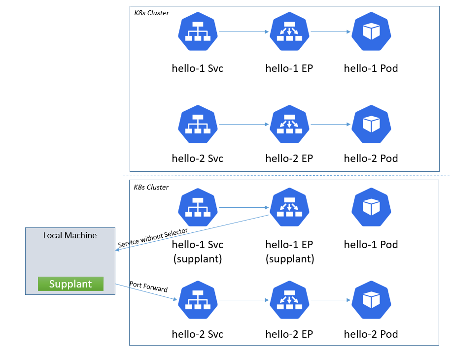

# supplant

## Overview

`supplant` is a tool used for improve the development experience with Kubernetes. The concept is to start with a 
working cluster with all of the deployed services in your application and then to supplant or 
replace a service using a new service without a selector and creating an endpoint
that points to your local machine.  The end result is that from within the cluster, the service now points to a port
on your machine outside the cluster.  To allow the code that you are developing/running outside the cluster
to reach any dependent services inside the cluster, those services are exposed individually via port forwarding.




## Why?
- Pushing new images to test a change works, but the code/test cycle is very slow
- It's very convenient to run all of your existing tooling including running the service under a debugger on your machine
- It uses standard K8s port forwarding and endpoints as the implementation which will hopefully be fairly reliable

## Why not?
- [Telepresence](https://github.com/telepresenceio/telepresence) is another more seamless approach at doing this, but 
 it has to use a bit of networking magic to make it happen and I've had a few reliability issues with it.  
- If your cluster can't reach back your local machine, this won't work.

## Installation

Binaries are available for [releases](https://github.com/tzneal/supplant/releases).

For Linux x64 you can install the latest release globally with:
```bash
sudo curl -sL https://github.com/tzneal/supplant/releases/latest/download/supplant_linux_x86_64 -o /usr/local/bin/supplant

sudo chmod a+x /usr/local/bin/supplant
```

Yyou can install directly using go with:

```bash
go install github.com/tzneal/supplant@latest
```

## Production Use

Please don't run this against a production cluster.  It attempts to replace services/endpoints and then return them
upon exit, but this hasn't undergone extensive testing. I use this with [kind](https://kind.sigs.k8s.io/) locally.

## Sample Usage

We'll launch and expose two deployments via services that listen on port 80 and 81 respectively.
```bash
# launch the first
$ kubectl create deployment hello-1 --image=k8s.gcr.io/echoserver:1.4
$ kubectl expose deployment hello-1 --port 80 --target-port 8080

# launch the second
$ kubectl create deployment hello-2 --image=k8s.gcr.io/echoserver:1.4
$ kubectl expose deployment hello-2 --port 81 --target-port 8080

# generate our config file
$ supplant config create test.yml
```

The generated test.yml will now look something like this, where each of the two services is listed under a `supplant` and an `external` section
within the YAML file.

```yml
supplant:
 - name: hello-1
   namespace: default
   enabled: false
   ports:
    - protocol: TCP
      port: 80
      localport: 0
 - name: hello-2
   namespace: default
   enabled: false
   ports:
    - protocol: TCP
      port: 81
      localport: 0
external:
 - name: hello-1
   namespace: default
   enabled: false
   ports:
    - protocol: TCP
      targetport: 8080
      localport: 0
 - name: hello-2
   namespace: default
   enabled: false
   ports:
    - protocol: TCP
      targetport: 8080
      localport: 0
```

We want to replace the `hello-1` service, but have our replacement be able to access the `hello-2` service.  So we enable
`hello-1` in the supplant section and `hello-2` in the external section.  We can then then clean our config file which removes 
any disabled services from the config file.

```bash
$ ./supplant config clean test.yml
```

The test.yml now looks like this:
```yaml
supplant:
 - name: hello-1
   namespace: default
   enabled: true
   ports:
    - protocol: TCP
      port: 80
      localport: 0
external:
 - name: hello-2
   namespace: default
   enabled: true
   ports:
    - protocol: TCP
      targetport: 8080
      localport: 0
```

We can now run `supplant` on this configuration file:

```bash
=> connecting to K8s
=> K8s version: v1.21.1
=> updating service hello-1
 - 192.168.1.129:40709 is now the endpoint for hello-1:80
=> forwarding for hello-2
 - 127.0.0.1:43099 points to remote hello-2:8080
forwarding ports, hit Ctrl+C to exit
```

The log lets us know that from within our cluster, anything trying to reach the hello-1 service will connect to 192.168.88.122:40709. 
The port 40709 was chosen at random since the listen port was specified as 0.  If a non-zero port were specified, it would be used
instead. `supplant` has also forwarded our local port 43099 to the hello-2 service at `hello-2:8080`. The listen port there works
the same way where specifying a non-zero port in the config file will listen on the specified port instead of a random open port.
We can verify that we have replaced the hello-1 service  by trying to reach it from the hello-2 pod which fails as we haven't
started anything listening on port 8080 yet.

```bash
$ kubectl exec -it deployment/hello-2 -- curl hello-1:80
curl: (7) Failed to connect to hello-1 port 80: Connection refused
command terminated with exit code 7
```

If we start a web server locally on port 8080, the connection will then work. In a separate shell we start a web server:
```bash
$ python3 -m http.server 40709                           
Serving HTTP on 0.0.0.0 port 40709 (http://0.0.0.0:40709/) ...
```

And then retry the connection to the hello-1 service, which now hits our Python web server.
```bash
$  kubectl exec -it deployment/hello-2 -- curl hello-1:80
<!DOCTYPE HTML PUBLIC "-//W3C//DTD HTML 4.01//EN" "http://www.w3.org/TR/html4/strict.dtd">
<html>
<head>
<meta http-equiv="Content-Type" content="text/html; charset=utf-8">
<title>Directory listing for /</title>
</head>
...
```

Lastly, we can verify that the port forward works locally as we can reach the hello-2 service.  This allows our local 
service to access any resources inside the cluster that it needs to.
```bash
$ curl 127.0.0.1:43099
CLIENT VALUES:
client_address=127.0.0.1
command=GET
real path=/
query=nil
request_version=1.1
request_uri=http://127.0.0.1:8080/
```
